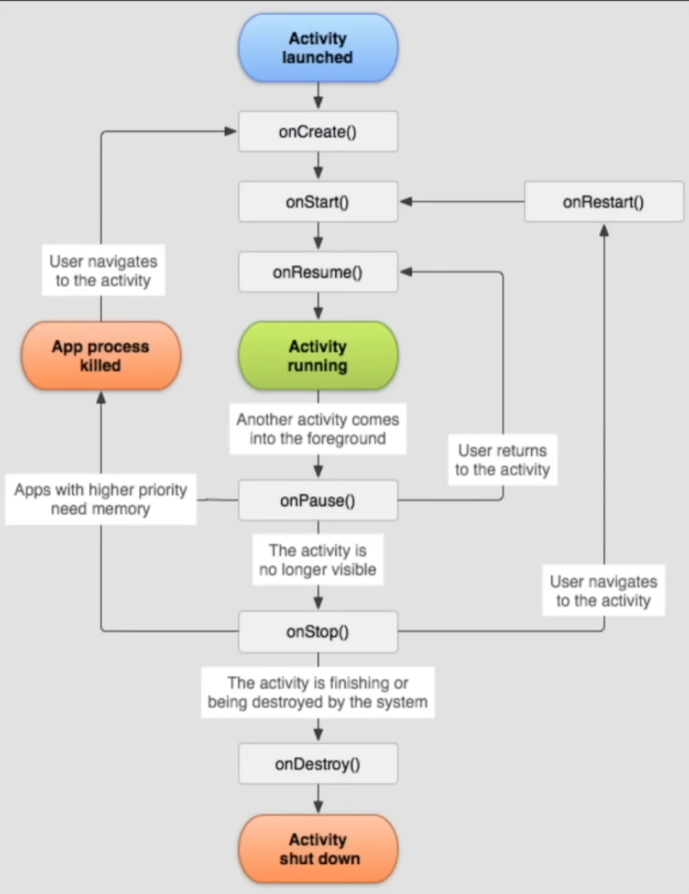
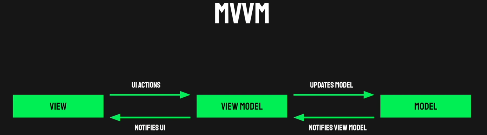

# Activity

```
Unit of the application the user interact with. The activity contains context information like if it is currenctly active on the sceen, if it is in bg, serves also as entrypoint for the app (i.e. the activity is the component that gets launched when the application is started).
```

With Jetpack compose you usually have just one activity.

## Lifecycle
At some point the activity is created and at later point also deleted. In between there is an entire collection of state that an action can have:
- `create` state -> initialize all variables in the activity, set views and general initialization (nothing is shown yet on the screen)
- `start` state -> when it becomes visible to the user (but he cannot interact with it yet)
- `resume` state -> This means that the activity is RUNNING. The activity in the foreground, user can interact with it. The RUNNING state is is kept till another activity is launched or another UI piece takes the foreground.
- `pause` state -> the activity is not in the foreground (or there is a dialog being shown), all variables and instances are kept in memory. NOTE: important data should  be saved in this stage as the following 2 stages are not called in special cases.
- `stop` state -> the activity is SURELY not visible to the user, for example if the user navigates to another screen.
- `destroy` state -> the user intentionally closed the activity (presses back button) or the code/os kills the activity to free-up resources. NOTE: Configuration changes (screen rotation, language change, etc.) cause the activity to be destroyed and recreated.


# Tasks

```
Collection of multiple screens or activity that form a backstack together. The backstack is a stack that contains the views that have been open in the order in which they were open.
Usually each app has its own task and android links them together.
```

## Launch mode
- `standard` -> a new instance of that activity will be pushed on the backstack.
- `single top` -> if there is already an existing instance of that activity the OS will use that one, i.e. does not create a new one.
- `single task` -> creates a new task (a new stack) in which that activity will be launched. The new task is independent of the previous launched task.
- `single instance` -> creates a new task (a new stack) in which that activity will be launched. The difference here is that, within this new task, only one instance of activity can exist, i.e. this stack contains at most one element.

# MVVM

Model - View - ViewModel is the preferred architectural pattern in Android.



# Context